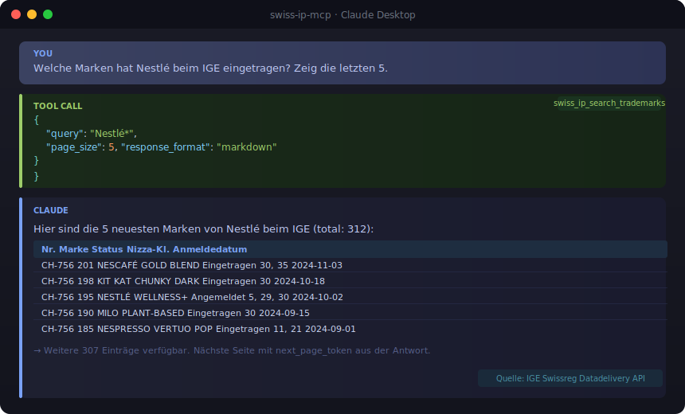

# swiss-ip-mcp

**MCP Server for Swiss Intellectual Property Data (IGE/IPI)**

[](https://github.com/malkreide/swiss-ip-mcp/actions)
[](https://www.python.org)
[](LICENSE)

🇩🇪 [Deutsche Version → README.de.md](README.de.md)

---

## Overview

`swiss-ip-mcp` is a [Model Context Protocol (MCP)](https://modelcontextprotocol.io/) server that gives AI models structured, language-driven access to the Swiss intellectual property register [Swissreg](https://www.swissreg.ch), operated by the **Swiss Federal Institute of Intellectual Property (IGE/IPI)**.

It is the successor to [`patent-mcp`](https://github.com/malkreide/patent-mcp) and covers all available domains of the [Swissreg Datadelivery API](https://www.swissreg.ch/public/apidocs/): trademarks, patents, patent publications, and supplementary protection certificates (SPC/ESZ).

**This server is model-agnostic.** It works with Claude, GPT-4, Llama, and any other MCP-compatible client – not just Claude Desktop.



---

## Example Queries

The real power is natural language. Instead of manually searching the register, just ask a question:

> "Which trademarks does the City of Zurich hold at the IGE?"

> "Is the name 'Learning City Zurich' registered as a trademark in Switzerland?"

> "Which pharmaceutical companies have filed Swiss patents in the last six months?"

> "Show me all trademark applications in the education sector (Nice class 41) since January 2025."

> "What supplementary protection certificates does Novartis hold in Switzerland?"

---

## Covered Domains

| Domain | Description |
|--------|-------------|
| **Trademarks** | Swiss trademark register – filing, protection, owners, Nice classes |
| **Patents** | CH patents – filing, grant, IPC classes, applicants, inventors |
| **Patent publications** | Official patent publications in the Swiss Official Gazette |
| **SPC / ESZ** | Supplementary protection certificates for medicinal and plant-protection products |

> **Note:** Design search is not yet available in the Swissreg Datadelivery API.

---

## Tools (11)

| Tool | Function |
|------|---------|
| `swiss_ip_search_trademarks` | Free-text trademark search (wildcard `*` supported) |
| `swiss_ip_get_trademark` | Retrieve a trademark by registration number |
| `swiss_ip_search_trademarks_by_owner` | Find all trademarks held by a given owner |
| `swiss_ip_search_trademarks_by_class` | Filter trademarks by Nice classification class |
| `swiss_ip_search_patents` | Free-text patent search |
| `swiss_ip_get_patent` | Retrieve a patent by number |
| `swiss_ip_search_patents_by_applicant` | Find patents by applicant or inventor name |
| `swiss_ip_search_patent_publications` | Search patent publications |
| `swiss_ip_search_spc` | SPC/ESZ search (pharma and plant protection) |
| `swiss_ip_search_recent_filings` | Filter filings by date range across all domains |
| `swiss_ip_get_quota` | Check remaining API data transfer quota |

---

## Architecture

```
AI client (Claude Desktop, Cursor, VS Code + Continue, …)
         │
         │  MCP (stdio or SSE)
         ▼
   swiss-ip-mcp
         │
         │  HTTPS + OAuth2 (IGE IDP)
         ▼
  Swissreg Datadelivery API
  https://www.swissreg.ch/public/api/v1
         │
         ├── TrademarkSearch
         ├── PatentSearch
         ├── PatentPublicationSearch
         ├── SPCSearch
         └── UserQuota
```

### Transport Modes

| Transport | Use case | Configuration |
|-----------|----------|---------------|
| **stdio** | Claude Desktop, local development | Default (no extra setup) |
| **SSE** | Cloud deployment (Render.com etc.) | `MCP_TRANSPORT=sse` |

---

## Prerequisites

1. **IGE credentials** (free): Sign the [terms of use](https://www.ige.ch/en/services/digital-resources/ip-data/data-delivery-api) and send the form by post to the IGE. Credentials are issued upon receipt.
2. **Python 3.11 or later**
3. **`uv`** (recommended) or `pip`

---

## Installation

```bash
# Run directly with uv (recommended, no local installation needed)
uvx swiss-ip-mcp

# Local development installation
git clone https://github.com/malkreide/swiss-ip-mcp
cd swiss-ip-mcp
pip install -e ".[dev]"
```

---

## Configuration

### Environment Variables

```bash
export IGE_USERNAME="your_username"
export IGE_PASSWORD="your_password"
```

### Claude Desktop

Open the config file:
- **macOS:** `~/Library/Application Support/Claude/claude_desktop_config.json`
- **Windows:** `%APPDATA%\Claude\claude_desktop_config.json`

```json
{
  "mcpServers": {
    "swiss-ip": {
      "command": "uvx",
      "args": ["swiss-ip-mcp"],
      "env": {
        "IGE_USERNAME": "your_username",
        "IGE_PASSWORD": "your_password"
      }
    }
  }
}
```

### Other MCP Clients

`swiss-ip-mcp` is compatible with any MCP-capable client:

| Client | Configuration |
|--------|--------------|
| Cursor | Add to `~/.cursor/mcp.json` (same format as Claude Desktop) |
| VS Code + Continue | Add via `continue.json` MCP server block |
| Windsurf | Add via MCP server settings |
| Self-hosted (mcp-proxy) | Use SSE transport with `MCP_TRANSPORT=sse` |

### Cloud / Render.com (SSE Transport)

```bash
MCP_TRANSPORT=sse PORT=8000 IGE_USERNAME=... IGE_PASSWORD=... swiss-ip-mcp
```

---

## Tests

```bash
# Unit tests (no credentials needed)
PYTHONPATH=src pytest tests/ -v

# Including live integration tests against the real API
IGE_USERNAME=... IGE_PASSWORD=... PYTHONPATH=src pytest tests/ -v
```

The CI workflow runs on Python 3.11, 3.12, and 3.13.

---

## Data Source

All data is provided by the [IGE/IPI Swissreg Datadelivery API](https://www.swissreg.ch/public/apidocs/). The API is free after signing the usage terms, subject to a monthly data transfer quota. Check your remaining quota at any time using the `swiss_ip_get_quota` tool.

---

## Safety & Limits

- **Read-only:** All tools perform authenticated POST requests to the Swissreg API — no data is written, modified, or deleted on any system.
- **No personal data:** The API returns public IP register entries (trademark names, patent titles, applicant organisations). No personally identifiable information (PII) is processed or stored by this server beyond what the IGE API returns in its public records.
- **Rate limits & quota:** The IGE Swissreg API enforces a monthly data transfer quota per account. Use the `swiss_ip_get_quota` tool to monitor remaining quota. The server enforces a 60s timeout per request. Avoid large `page_size` values (>20) for exploratory queries.
- **Authentication:** Credentials (`IGE_USERNAME`, `IGE_PASSWORD`) are read from environment variables at runtime and never logged or persisted.
- **Terms of service:** Data is subject to the [IGE Swissreg Datadelivery API terms of use](https://www.ige.ch/en/services/digital-resources/ip-data/data-delivery-api). A signed usage agreement with IGE/IPI is required before API access is granted.
- **No guarantees:** This server is a community project, not affiliated with the Swiss Federal Institute of Intellectual Property (IGE/IPI). Availability depends on upstream API uptime.

---

## Related Servers

| Server | Content |
|--------|---------|
| [`zurich-opendata-mcp`](https://github.com/malkreide/zurich-opendata-mcp) | City of Zurich open data (CKAN, weather, parking, geodata) |
| [`fedlex-mcp`](https://github.com/malkreide/fedlex-mcp) | Swiss federal law via Fedlex SPARQL |
| [`swiss-transport-mcp`](https://github.com/malkreide/swiss-transport-mcp) | Public transport, disruptions, tickets, train formations |
| [`swiss-road-mobility-mcp`](https://github.com/malkreide/swiss-road-mobility-mcp) | Shared mobility, EV charging stations, traffic data |
| [`global-education-mcp`](https://github.com/malkreide/global-education-mcp) | UNESCO / OECD education data |
| [`patent-mcp`](https://github.com/malkreide/patent-mcp) | ⚠️ Deprecated – superseded by this server |

---

## License

MIT © 2026 malkreide
