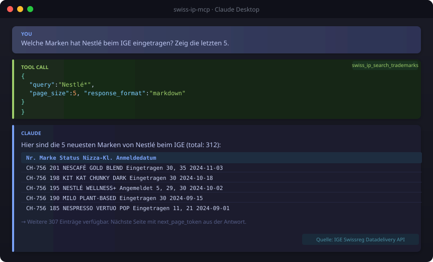

🇨🇭 **Part of the [Swiss Public Data MCP Portfolio](https://github.com/malkreide/swiss-public-data-mcp)**

# 💡 swiss-ip-mcp

**MCP Server for Swiss Intellectual Property Data (IGE/IPI)**


[](LICENSE)
[](https://www.python.org/downloads/)
[](https://modelcontextprotocol.io/)
[](https://www.swissreg.ch/public/apidocs/)
[](https://github.com/malkreide/swiss-ip-mcp/actions)

🇩🇪 [Deutsche Version → README.de.md](README.de.md)

---

## Overview

`swiss-ip-mcp` is a [Model Context Protocol (MCP)](https://modelcontextprotocol.io/) server that gives AI models structured, language-driven access to the Swiss intellectual property register [Swissreg](https://www.swissreg.ch), operated by the **Swiss Federal Institute of Intellectual Property (IGE/IPI)**.

It is the successor to [`patent-mcp`](https://github.com/malkreide/patent-mcp) and covers all available domains of the [Swissreg Datadelivery API](https://www.swissreg.ch/public/apidocs/): trademarks, patents, patent publications, and supplementary protection certificates (SPC/ESZ).

**This server is model-agnostic.** It works with Claude, GPT-4, Llama, and any other MCP-compatible client – not just Claude Desktop.



---

## Example Queries

The real power is natural language. Instead of manually searching the register, just ask a question:

> "Which trademarks does the City of Zurich hold at the IGE?"

> "Is the name 'Learning City Zurich' registered as a trademark in Switzerland?"

> "Which pharmaceutical companies have filed Swiss patents in the last six months?"

> "Show me all trademark applications in the education sector (Nice class 41) since January 2025."

> "What supplementary protection certificates does Novartis hold in Switzerland?"

---

## Covered Domains

| Domain | Description |
|--------|-------------|
| **Trademarks** | Swiss trademark register – filing, protection, owners, Nice classes |
| **Patents** | CH patents – filing, grant, IPC classes, applicants, inventors |
| **Patent publications** | Official patent publications in the Swiss Official Gazette |
| **SPC / ESZ** | Supplementary protection certificates for medicinal and plant-protection products |

> **Note:** Design search is not yet available in the Swissreg Datadelivery API.

---

## Tools (11)

| Tool | Function |
|------|---------|
| `swiss_ip_search_trademarks` | Free-text trademark search (wildcard `*` supported) |
| `swiss_ip_get_trademark` | Retrieve a trademark by registration number |
| `swiss_ip_search_trademarks_by_owner` | Find all trademarks held by a given owner |
| `swiss_ip_search_trademarks_by_class` | Filter trademarks by Nice classification class |
| `swiss_ip_search_patents` | Free-text patent search |
| `swiss_ip_get_patent` | Retrieve a patent by number |
| `swiss_ip_search_patents_by_applicant` | Find patents by applicant or inventor name |
| `swiss_ip_search_patent_publications` | Search patent publications |
| `swiss_ip_search_spc` | SPC/ESZ search (pharma and plant protection) |
| `swiss_ip_search_recent_filings` | Filter filings by date range across all domains |
| `swiss_ip_get_quota` | Check remaining API data transfer quota |

### Resources & Prompts

Beyond tools, the server exposes two more MCP primitives:

**Resources** (read-only metadata, `swissip://` URI scheme):

| URI | Content |
|-----|---------|
| `swissip://about` | Server + data-source metadata (provenance, covered domains) |
| `swissip://domains` | List of covered IP domains |

**Prompts** (curated workflow templates):

| Prompt | Arguments | Purpose |
|--------|-----------|---------|
| `trademark_availability` | `name` | Check whether a name is a registered Swiss trademark |
| `competitor_ip_report` | `company` | IP overview (trademarks + patents) for a company |
| `recent_ip_filings_report` | `ip_type, date_from, date_to` | Report on recent filings in a period |

### Error semantics

Tool **execution errors** (API failures, timeouts, missing credentials) are
returned with MCP `isError: true` and a masked, user-friendly message — internal
details (stack traces, raw API bodies) go only to the server log. A specific
number lookup that finds nothing is **not** an error: it returns a normal result
with `match_type: "none"` and a `message`.

---

## Project Phase

This server is in **Phase 1 (read-only)** of the MCP phased-rollout model: every
tool is read-only and writes nothing. See [`ROADMAP.md`](ROADMAP.md) for the
phase plan and the prerequisites for any future write-capable phase.

---

## Architecture

```
AI client (Claude Desktop, Cursor, VS Code + Continue, …)
         │
         │  MCP (stdio or SSE)
         ▼
   swiss-ip-mcp
         │
         │  HTTPS + OAuth2 (IGE IDP)
         ▼
  Swissreg Datadelivery API
  https://www.swissreg.ch/public/api/v1
         │
         ├── TrademarkSearch
         ├── PatentSearch
         ├── PatentPublicationSearch
         ├── SPCSearch
         └── UserQuota
```

### Transport Modes

| Transport | Use case | Configuration |
|-----------|----------|---------------|
| **stdio** | Claude Desktop, local development | Default (no extra setup) |
| **Streamable HTTP** | Cloud deployment (Render.com etc.) | `MCP_TRANSPORT=streamable-http` |
| **SSE** | Legacy HTTP clients | `MCP_TRANSPORT=sse` |

Transport is selected at startup from the `MCP_TRANSPORT` environment variable
(default `stdio`). The HTTP transports are served by uvicorn and honour:

| Variable | Default | Purpose |
|----------|---------|---------|
| `MCP_HOST` | `127.0.0.1` | Bind address. Use `0.0.0.0` **only** inside a container / behind a reverse proxy. |
| `PORT` / `MCP_PORT` | `8000` | Bind port (`PORT` wins — PaaS convention). |
| `MCP_ALLOWED_ORIGINS` | _(empty)_ | Comma-separated CORS origin allow-list. No wildcard in production. |
| `MCP_ALLOWED_HOSTS` | _(empty)_ | Comma-separated `Host`-header allow-list; enables DNS-rebinding protection when set. |

The `Mcp-Session-Id` header is exposed via CORS so browser-based clients can
read and echo it on follow-up requests.

---

## Prerequisites

1. **IGE credentials** (free): Sign the [terms of use](https://www.ige.ch/en/services/digital-resources/ip-data/data-delivery-api) and send the form by post to the IGE. Credentials are issued upon receipt.
2. **Python 3.11 or later**
3. **`uv`** (recommended) or `pip`

---

## Installation

```bash
# Run directly with uv (recommended, no local installation needed)
uvx swiss-ip-mcp

# Local development installation
git clone https://github.com/malkreide/swiss-ip-mcp
cd swiss-ip-mcp
pip install -e ".[dev]"
```

---

## Configuration

### Environment Variables

```bash
export IGE_USERNAME="your_username"
export IGE_PASSWORD="your_password"
```

### Claude Desktop

Open the config file:
- **macOS:** `~/Library/Application Support/Claude/claude_desktop_config.json`
- **Windows:** `%APPDATA%\Claude\claude_desktop_config.json`

```json
{
  "mcpServers": {
    "swiss-ip": {
      "command": "uvx",
      "args": ["swiss-ip-mcp"],
      "env": {
        "IGE_USERNAME": "your_username",
        "IGE_PASSWORD": "your_password"
      }
    }
  }
}
```

### Other MCP Clients

`swiss-ip-mcp` is compatible with any MCP-capable client:

| Client | Configuration |
|--------|--------------|
| Cursor | Add to `~/.cursor/mcp.json` (same format as Claude Desktop) |
| VS Code + Continue | Add via `continue.json` MCP server block |
| Windsurf | Add via MCP server settings |
| Self-hosted (mcp-proxy) | Use SSE transport with `MCP_TRANSPORT=sse` |

### Cloud / Render.com (Streamable HTTP)

```bash
MCP_TRANSPORT=streamable-http \
  MCP_HOST=0.0.0.0 PORT=8000 \
  MCP_ALLOWED_ORIGINS="https://your-client.example" \
  MCP_ALLOWED_HOSTS="your-app.onrender.com" \
  IGE_USERNAME=... IGE_PASSWORD=... \
  swiss-ip-mcp
```

> **Security note:** bind to `0.0.0.0` only inside a container or behind a
> reverse proxy. Always set `MCP_ALLOWED_ORIGINS` and `MCP_ALLOWED_HOSTS` for
> public deployments — this enables CORS scoping and DNS-rebinding protection.
> The endpoint is unauthenticated and serves only public IP-register data; do
> not place credentialed or non-public tools behind this transport without
> adding authentication first.

### Docker / Kubernetes

A hardened multi-stage [`Dockerfile`](Dockerfile) (non-root UID 10001,
`HEALTHCHECK` on `/health`), a [`docker-compose.yml`](docker-compose.yml) with
resource limits, and Kubernetes manifests + an HAProxy sticky-session config
under [`deploy/`](deploy/) are included.

```bash
docker compose up --build   # reads IGE_* from .env
```

See [`docs/deployment.md`](docs/deployment.md) for hardening, resource limits and
scaling (stateless vs. sticky-session) details.

---

## Tests

```bash
# Unit tests (no credentials needed)
PYTHONPATH=src pytest tests/ -v

# Including live integration tests against the real API
IGE_USERNAME=... IGE_PASSWORD=... PYTHONPATH=src pytest tests/ -v
```

The CI workflow runs on Python 3.11, 3.12, and 3.13.

---

## Observability (optional)

The server can emit OpenTelemetry traces — one span per tool call plus child
spans for the backend Swissreg/IDP HTTP calls. Tracing is **off by default** and
adds no overhead until enabled.

```bash
pip install 'swiss-ip-mcp[otel]'

MCP_OTEL_ENABLED=1 \
  OTEL_EXPORTER_OTLP_ENDPOINT=http://your-collector:4318 \
  MCP_ENV=production \
  swiss-ip-mcp
```

| Variable | Purpose |
|----------|---------|
| `MCP_OTEL_ENABLED` | Set to `1` to enable trace export (or just set the endpoint below). |
| `OTEL_EXPORTER_OTLP_ENDPOINT` | OTLP/HTTP collector endpoint (standard OTEL variable). |
| `MCP_ENV` | Value for the `deployment.environment` resource attribute (default `production`). |

Tool spans carry only `mcp.tool.name` and `mcp.tool.result.is_error` — **no
query arguments, credentials or response bodies** are recorded.

### Logging

The server logs structured JSON to **stderr** (stdout is reserved for the
stdio protocol). Every tool call binds a `tool` name and a `correlation_id`, so
all log lines for one call are correlated. Set the level with `LOG_LEVEL`
(`DEBUG` / `INFO` / `WARNING` / `ERROR`, default `INFO`):

```json
{"event": "tool.call.start", "tool": "swiss_ip_search_trademarks", "correlation_id": "da55…", "level": "info", "timestamp": "…Z"}
```

---

## MCP Protocol Version

The MCP protocol version is provided by the pinned [MCP Python SDK](https://github.com/modelcontextprotocol/python-sdk) (`mcp`, used via `fastmcp`) and negotiated per the spec during `initialize` — the server agrees on the highest version both it and the client support. With the currently pinned SDK the latest supported version is **`2025-11-25`** (older clients negotiate down automatically). This value follows the SDK, so it is not hard-coded here.

**Update policy:** the SDK floor is pinned in `pyproject.toml`; [Dependabot](.github/dependabot.yml) opens monthly PRs for `mcp` / `fastmcp` updates. Protocol-version or SDK bumps that change behaviour are reviewed in those PRs and recorded in [`CHANGELOG.md`](CHANGELOG.md).

---

## Data Source

All data is provided by the [IGE/IPI Swissreg Datadelivery API](https://www.swissreg.ch/public/apidocs/). The API is free after signing the usage terms, subject to a monthly data transfer quota. Check your remaining quota at any time using the `swiss_ip_get_quota` tool.

| Field | Value |
|-------|-------|
| Provider | Swiss Federal Institute of Intellectual Property (IGE/IPI) |
| Source | Swissreg Datadelivery API — <https://www.swissreg.ch/public/apidocs/> |
| License / terms | [IGE/IPI Swissreg Datadelivery API Terms of Use](https://www.ige.ch/en/services/digital-resources/ip-data/data-delivery-api) |

**Provenance:** every tool response carries a `source` block (provider, source
URL, license) so downstream consumers retain attribution. The result envelope is
`{ source, total, count, match_type, results, next_page_token }`.

---

## Safety & Limits

- **Read-only:** All tools perform authenticated POST requests to the Swissreg API — no data is written, modified, or deleted on any system.
- **No personal data:** The API returns public IP register entries (trademark names, patent titles, applicant organisations). No personally identifiable information (PII) is processed or stored by this server beyond what the IGE API returns in its public records.
- **Rate limits & quota:** The IGE Swissreg API enforces a monthly data transfer quota per account. Use the `swiss_ip_get_quota` tool to monitor remaining quota. The server enforces a 60s timeout per request. Avoid large `page_size` values (>20) for exploratory queries.
- **Authentication:** Credentials (`IGE_USERNAME`, `IGE_PASSWORD`) are read from environment variables at runtime and never logged or persisted.
- **Terms of service:** Data is subject to the [IGE Swissreg Datadelivery API terms of use](https://www.ige.ch/en/services/digital-resources/ip-data/data-delivery-api). A signed usage agreement with IGE/IPI is required before API access is granted.
- **No guarantees:** This server is a community project, not affiliated with the Swiss Federal Institute of Intellectual Property (IGE/IPI). Availability depends on upstream API uptime.

---

## Related Servers

| Server | Content |
|--------|---------|
| [`zurich-opendata-mcp`](https://github.com/malkreide/zurich-opendata-mcp) | City of Zurich open data (CKAN, weather, parking, geodata) |
| [`fedlex-mcp`](https://github.com/malkreide/fedlex-mcp) | Swiss federal law via Fedlex SPARQL |
| [`swiss-transport-mcp`](https://github.com/malkreide/swiss-transport-mcp) | Public transport, disruptions, tickets, train formations |
| [`swiss-road-mobility-mcp`](https://github.com/malkreide/swiss-road-mobility-mcp) | Shared mobility, EV charging stations, traffic data |
| [`global-education-mcp`](https://github.com/malkreide/global-education-mcp) | UNESCO / OECD education data |
| [`patent-mcp`](https://github.com/malkreide/patent-mcp) | ⚠️ Deprecated – superseded by this server |

---

## Contributing

See [`CONTRIBUTING.md`](CONTRIBUTING.md) ([Deutsch](CONTRIBUTING.de.md)) for how to
report bugs and submit changes.

---

## Security

See [`SECURITY.md`](SECURITY.md) for the security posture, hardening summary, and how to report a vulnerability.

---

## License

MIT License — see [LICENSE](LICENSE)

---

## Author

**Hayal Oezkan** · [github.com/malkreide](https://github.com/malkreide)

<!-- mcp-name: io.github.malkreide/swiss-ip-mcp -->

<!-- BEGIN GENERATED: install -->
## Installation

Run via [`uv`](https://docs.astral.sh/uv/)'s `uvx` — no clone or manual install needed. Add to your MCP client config (`mcpServers` for Claude Desktop, Cursor and Windsurf; use a top-level `servers` key for VS Code in `.vscode/mcp.json`):

```json
{
  "mcpServers": {
    "swiss-ip-mcp": {
      "command": "uvx",
      "args": [
        "swiss-ip-mcp"
      ],
      "env": {
        "IGE_USERNAME": "<your IGE_USERNAME>",
        "IGE_PASSWORD": "<your IGE_PASSWORD>"
      }
    }
  }
}
```

Requires credentials: set `IGE_USERNAME`, `IGE_PASSWORD` (replace the placeholder values above).
<!-- END GENERATED: install -->
